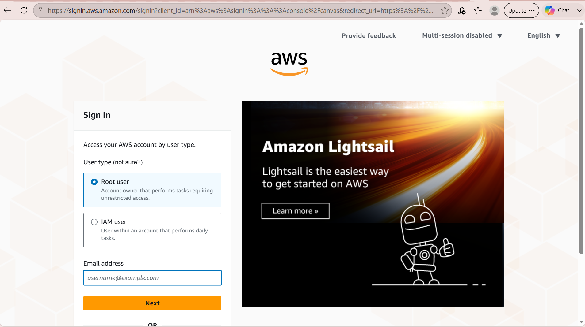

# Cloud Monitoring Runbook

## Purpose

This runbook explains how to access Amazon CloudWatch from the AWS Management Console to monitor cloud resources and system health.

## Audience

Cloud Engineers, SRE Engineers, and IT Support teams.

## Prerequisites

- AWS account
- Valid AWS credentials
- Permission to access CloudWatch

## Procedure

### Step 1: Sign in to the AWS Management Console

Log in to the AWS Management Console using your AWS account credentials.

### Step 2: Open CloudWatch

In the search bar at the top of the console, type **CloudWatch** and select the service from the list.

### Step 3: Review Monitoring Information

Use the CloudWatch dashboard to:

- View metrics
- Monitor alarms
- Check logs
- Review dashboards
- Monitor application performance

## Verification

Verify that the CloudWatch dashboard loads successfully and displays your available resources.

## Troubleshooting

| Issue | Solution |
|--------|----------|
| Unable to log in | Verify your AWS credentials and MFA settings. |
| CloudWatch does not appear | Check that your AWS account has the required permissions (IAM). |
| No metrics are displayed | Confirm that resources are running and sending metrics to CloudWatch. |

## Related Documentation

- AWS CloudWatch User Guide
- AWS Identity and Access Management (IAM) Documentation